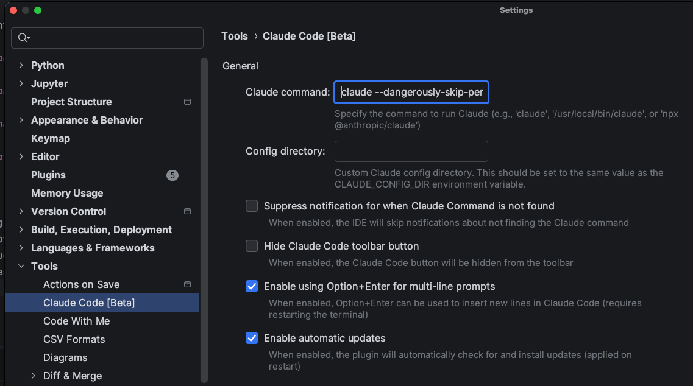

# Overview

These are the basics of using Claude code.

# Initial setup

Get an account and install it. Duh!
See https://code.claude.com/docs/en/overview

## IDE Integration

You run it in a terminal, which can also be embedded in your IDE. See:
https://code.claude.com/docs/en/jetbrains
https://code.claude.com/docs/en/vs-code

## Permissions

Claude will ask you constantly for permissions. You can be as permissive or restrictive as you like.

I go with full permissions, YMMV.

```
cl='claude --dangerously-skip-permissions'
```

# Using Claude code

## Using Claude Code in the terminal

Claude Code is a super fancy CLI. It does a lot of magic with dynamic refreshing, status updates, syntax highlighting and whatnot. It needs to jump through some hoops to make it work. The [infamous flickering bug](https://github.com/anthropics/claude-code/issues/769#issuecomment-3667315590) is where you feel it the most as a user. Anthropic has been working on it for months. They made progress, but I still run into it from time to time as of January 2nd 2026 on version. 

I use it with iTerm2 on Mac. The main thing to know is how to type multi-line text because just typing `<return / enter>` sends the current text to Claude. In iTerm2 you can type `shift + return` to start a new line.

You may need to run the `/terminal-setup` slash command once to make it work.

## Using Claude Code in IDEs

Claude code has plugins/extensions for different IDEs. I'm a JetBrains die-hard (sorry VS Code and its progeny).I use mostly PyCharm, Goland and RustRover.

JetBrains IDEs (as well as many other IDEs) provide s built-in terminal. You just type 'claude' in such a built-in terminal window and hope for the best. But, `shift+return` may not work for you. You have a few options:

- type `\+return` 
- type `ctrl+j`
- install the Claude Code plugin and use `option+return`


Note that `option+return` don't work in RustRover even after installing the plugin. It seems to be buggy in general and complains that Claude code is not installed. ¯\_(ツ)_/¯.

The plugin by default runs simply the command `claude` so it will ask you annoyingly for permissions. But, you can customize the command and add the `--dangerously-skip-permissions` flag.



## Resuming previous sessions

Claude keeps track of previous sessions. You can resume the very last session with:

```
cl --continue
```

I have an alias 
```shell
alias clc='cl --continue'
```

This is my primary resume mode when something goes wrong at the terminal-level (flickering, hanging, etc) and I want to reset the terminal session and continue where I left, so I kill the terminal session with ctrl+C (or two) and then type `clc`.

If you want to resume another previous session you can type:

```
cl --resume
```

You can also type the `/resume` slash command in Claude code.

In both cases you will get a list of previous sessions to choose from.

## Slash commands

Claude code has many slash commands. Just type `/` and you'll see a list of commands. The abovementioned `/terminal-setup` is one of them

See [Slash Commands](slash-commands.md) for details.

## Shortcuts

Claude Code has several keyboard shortcuts that control how it works. Type `?` to see all of them 

```
  ! for bash mode       double tap esc to clear input      ctrl + _ to undo
  / for commands        shift + tab to auto-accept edits   ctrl + z to suspend
  @ for file paths      ctrl + o for verbose output        ctrl + v to paste images
  & for background      ctrl + t to show todos             opt + p to switch model
                        shift + ⏎ for newline              ctrl + s to stash prompt
```

Note that `shift + tab` cycles through the permissions modes, so `auto-accept edits` is displayed just because currently I'm in the `bypass permissions` mode. There is one more permission mode `plan`, in which Claude Code will discuss and plan, but will not make changes to your files.  

## Running shell commands

You can quickly run shell commands with the `!` modifier. For example, `! pwd` will run the `pwd` command and insert the
output into the conversation.


## Other Ways to Use Claude Code

There are several other ways to use Claude code. I don't really use them at the moment:

- [Claude Code on the Web](https://code.claude.com/docs/en/claude-code-on-the-web)
- [Claude Code on Desktop](https://code.claude.com/docs/en/desktop)
- [Claude Code in Slack](https://code.claude.com/docs/en/slack)
- [Claude Code GithubActions](https://code.claude.com/docs/en/github-actions)
- [Claude Code in Chrome](https://code.claude.com/docs/en/chrome)

